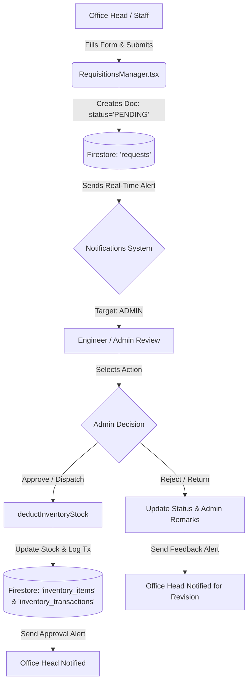
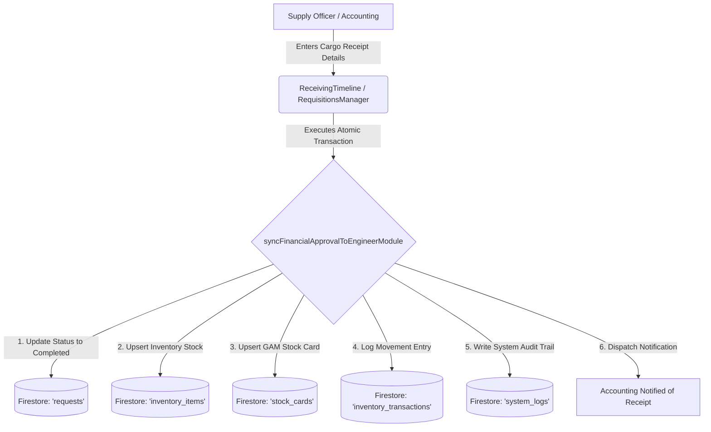
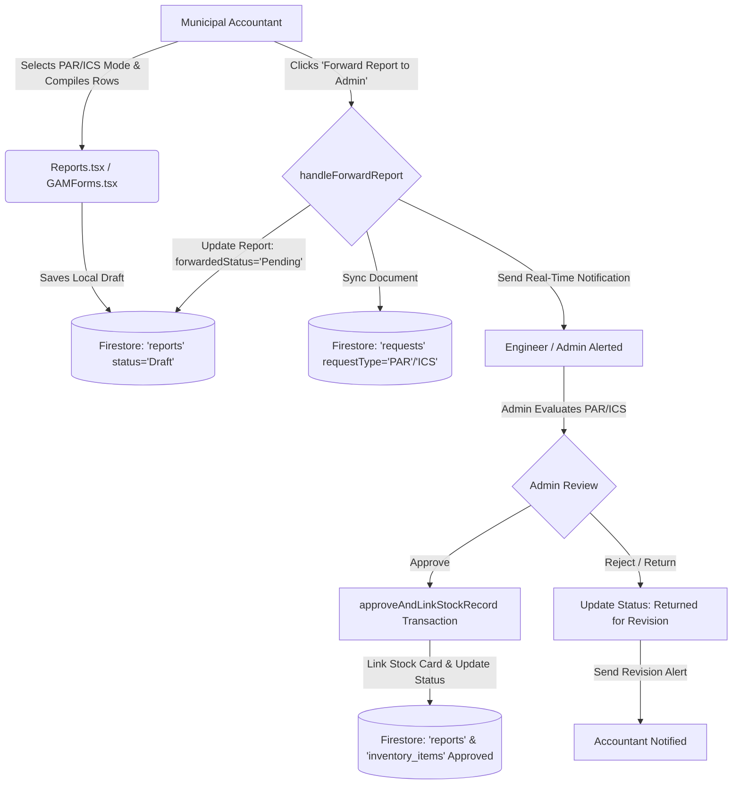

# System Process & Architecture Documentation: Centralized Inventory and Resource Tracking System of LGU Tibiao

> **Document Note**: This document contains a comprehensive read-only analysis of the codebase for the **Centralized Inventory and Resource Tracking System of LGU Tibiao**. All findings, file references, role restrictions, data structures, and workflows detailed below are directly extracted from the project files.

---

## 1. OVERVIEW

### Application Overview
* **Application Name**: Centralized Inventory and Resource Tracking System of LGU Tibiao (`centralized-inventory-and-resource-tracking-system-of-lgu-tibiao`)
* **Purpose**: A cloud-enabled government resource tracking, procurement management, inventory control, and Government Accounting Manual (GAM) reporting system designed specifically for the Local Government Unit (LGU) of Tibiao, Antique, Philippines. It automates inventory receipts, asset classification (PAR vs. ICS), property tag/sticker generation, inter-office asset transfers, and official report generation.
* **Technology Stack**:
  * **Frontend**: React 19 (`react`, `react-dom`), TypeScript 5.8, Tailwind CSS v4 (`@tailwindcss/vite`), Motion / Framer Motion (`motion/react`), Lucide Icons (`lucide-react`), HTML5 QR Scanner (`html5-qrcode`), QR Code Generator (`qrcode.react`), Recharts (`recharts`), Vite 6 (`vite`).
  * **Backend**: Express 5 (`express`), Node.js (v22+ runtime), Multer (`multer`) for memory storage and file uploading, CORS (`cors`), UUID (`uuid`), bundled via `esbuild` and executed via `tsx`.
  * **Database**: Firebase Firestore (`firebase/firestore`), with client-side local offline queue using IndexedDB (`offlineDb.ts`) and Service Worker caching (`public/sw.js`).
  * **Authentication**: Firebase Authentication (`firebase/auth`) with email/password authentication, paired with hardcoded whitelisted system accounts (`lib/accounts.ts`) and fallback local state bypass.
* **How to Run the Application**:
  * **Development Mode**: Execute `npm run dev` (runs `tsx server.ts`, launching Express on port `3000` with Vite middleware for SPA hot reloading).
  * **Production Build**: Execute `npm run build` (runs `vite build` to bundle frontend into `/dist` and `esbuild server.ts --bundle --platform=node --format=cjs --packages=external --sourcemap --outfile=dist/server.cjs`).
  * **Production Server**: Execute `npm run start` (runs `node dist/server.cjs` serving static assets from `/dist` and express endpoints on port `3000`).
  * **Type Checking & Linting**: Execute `npm run lint` (runs `tsc --noEmit`).

### Folder Structure Summary (Top 2 Levels)
```
├── .git                                      # Git version control metadata
├── .gitignore                                # Git ignore file rules
├── App.tsx                                   # Main React root application layout, routing & state container
├── README.md                                 # Basic repository overview instructions
├── android                                   # Native Android wrapper project files
├── build_output.txt                          # Previous build execution console log output
├── bun.lock                                  # Bun package lock file
├── components                                # React UI feature components & helper utilities (25 files)
├── corrected_sections.txt                    # Project documentation draft snippets
├── corrected_tables_figures.txt              # System documentation tables & figures draft
├── diagrams                                  # Architecture, ERD, sequence & wireframe HTML/Draw.io files
├── dist                                      # Compiled production build directory
├── docs                                      # Interactive HTML system flowchart documentation
├── firebase-applet-config.json               # Firebase Applet configuration metadata
├── firebase-blueprint.json                   # Firebase schema blueprint documentation
├── firebase.ts                               # Firebase SDK initialization (Auth & Firestore)
├── firestore.rules                           # Cloud Firestore security & authorization rules
├── hooks                                     # Custom React hooks for auth, subscriptions, actions, routing
├── index.css                                 # Global CSS Tailwind v4 styles & custom scrollbars
├── index.html                                # HTML index entry point
├── index.tsx                                 # React DOM entry point
├── lib                                       # Utility libraries (account whitelist, error handling, image helper)
├── metadata.json                             # Application metadata specifications
├── node_modules                              # Project npm dependencies
├── officialLguData.ts                        # Pre-seeded official LGU inventory master data (MDRRMO, etc.)
├── offlineDb.ts                              # IndexedDB offline transaction queue helper
├── package-lock.json                         # NPM dependency lockfile
├── package.json                              # Node package configuration & dependency scripts
├── public                                    # Static assets (service worker sw.js, manifest, images)
├── schema.sql                                # Relational schema reference script
├── server.ts                                 # Node/Express backend server & file upload API endpoints
├── tibiao-logo.png                           # LGU Tibiao official seal logo image
├── tibiao-municipalhall.jpg                  # LGU Tibiao Municipal Hall cover image
├── tsconfig.json                             # TypeScript compiler configuration
├── types.ts                                  # Global TypeScript interfaces, enums, & data contracts
├── uploads                                   # Server directory holding uploaded asset images (/uploads/inventory/YYYY/MM)
├── vercel.json                               # Vercel deployment configuration
└── vite.config.ts                            # Vite build tool setup configuration
```

---

## 2. ROLES AND PERMISSIONS

### User Roles Defined
Defined in `UserRole` enum (`types.ts#L18-L26`):
1. **`ADMIN`** (Municipal Administrator / Municipal Engineer)
2. **`MAYOR`** (Municipal Mayor / Executive)
3. **`OFFICE_HEAD`** (Department / Office Head)
4. **`SUPPLY`** (Supply Officer / Property Custodian)
5. **`ACCOUNTING`** (Municipal Accountant)
6. **`STAFF`** (General End User / Staff)
7. **`UNAUTHORIZED`** (Unapproved / Restricted User)

### Role Permissions & Capabilities

| Role | Accessible Views | Create Capabilities | Edit / Update Capabilities | Approve / Decision Capabilities | Delete / Purge Capabilities |
| :--- | :--- | :--- | :--- | :--- | :--- |
| **`ADMIN`** | `DASHBOARD`, `ITEMS`, `RECEIVING`, `REQUESTS`, `STICKERS`, `REPORTS`, `TRANSACTIONS`, `AUDIT`, `DATABASE`, `OFFICES`, `PROFILE`, `NOTIFICATIONS` | Create inventory items, offices, requisitions, PAR/ICS forms, official reports, user accounts, demo data. | Edit any inventory item, master asset, office details, requisition status, report status, audit notes. | Final approval authority for requisitions, financial requests, PAR/ICS shipment requests, asset transfers. | Delete inventory items, master assets, offices, requests, reports, audit logs. |
| **`MAYOR`** | `DASHBOARD`, `ITEMS`, `RECEIVING`, `REQUESTS`, `STICKERS`, `REPORTS`, `TRANSACTIONS`, `PROFILE`, `NOTIFICATIONS` | Create receiving requests, notes, executive inquiries. | Update executive remarks on receiving timeline. | Approve high-level receiving requests and executive requisitions. | None. |
| **`OFFICE_HEAD`** | `DASHBOARD`, `ITEMS`, `RECEIVING`, `REQUESTS`, `STICKERS`, `REPORTS`, `TRANSACTIONS`, `PROFILE`, `NOTIFICATIONS` | Create asset requisitions, financial requests, inter-office transfer requests, draft office reports. | Edit own department's pending requisitions, update assigned staff for department assets. | Approve internal office asset assignments. | Delete own pending draft requests (before approval). |
| **`ACCOUNTING`** | `DASHBOARD`, `ITEMS`, `RECEIVING`, `REQUESTS`, `STICKERS`, `REPORTS`, `TRANSACTIONS`, `PROFILE`, `NOTIFICATIONS` | Generate PAR and ICS forms (`components/Reports.tsx`), create financial requests. | Edit financial requests, compile PAR/ICS draft fields. Restricted from uploading raw asset images via server endpoint (`server.ts#L89`). | Verify and approve financial request stages; forward compiled PAR/ICS forms to Admin. | Cannot delete master inventory records. |
| **`SUPPLY`** | `DASHBOARD`, `ITEMS`, `RECEIVING`, `REQUESTS`, `STICKERS`, `REPORTS`, `TRANSACTIONS`, `OFFICES`, `PROFILE`, `NOTIFICATIONS` | Receive physical items, log receiving timeline records, generate QR code stickers. | Update inventory stock quantities, condition, and location. | Confirm physical receipt of cargo. | Cannot delete master database items. |
| **`STAFF`** | `DASHBOARD`, `ITEMS`, `REQUESTS`, `PROFILE`, `NOTIFICATIONS` | Submit basic item/requisition requests. | Edit own pending profile and request details. | None. | None. |
| **`UNAUTHORIZED`** | None (Access Restricted Screen) | None. | None. | None. | None. |

### Where Role Checks Are Enforced

1. **Default Navigation & Permissions Matrix**:
   * File: `hooks/useAuth.ts#L8-L33` (`DEFAULT_PERMISSIONS` dictionary). Enforces view visibility mapping.
2. **Dashboard Role View Router**:
   * File: `App.tsx#L229-L295` (`renderRoleView` function).
   * Checks `userProfile.role`:
     * `UserRole.MAYOR` $\rightarrow$ renders `<MayorDashboard />`
     * `UserRole.OFFICE_HEAD` $\rightarrow$ renders `<OfficeHeadDashboard />`
     * `UserRole.ACCOUNTING` $\rightarrow$ renders `<AccountingDashboard />`
     * Other roles $\rightarrow$ renders main sidebar layout.
3. **Form & Reporting Authorization**:
   * File: `components/Reports.tsx#L226-L243` (`isFormAuthorized` function).
   * Checks if `ACCOUNTING` is accessing `par` or `ics` modes vs. `ADMIN`/`OFFICE_HEAD` mode rules. Logs security violation `403 FORBIDDEN` to `system_logs` and `access_logs` if unauthorized (`components/Reports.tsx#L246-L271`).
4. **Requisition & PAR/ICS Decision Authorization**:
   * File: `components/RequisitionsManager.tsx#L1246-L1250`.
   * Enforces: `if (selectedRequest.requestType === 'PAR' || selectedRequest.requestType === 'ICS')` and `userRole !== UserRole.ADMIN`, alerts `"Unauthorized. Only the Engineer/Admin is authorized to evaluate or approve shipment (PAR/ICS) requests."`
5. **Inventory Record Deletion Protection**:
   * File: `hooks/useInventoryActions.ts#L327-L330` (`handleRemoveItem`).
   * Enforces: `if (userProfile.role !== UserRole.ADMIN)` $\rightarrow$ blocks deletion with alert `"Only administrators can delete inventory records."`
6. **Master Data Record Modification Protection**:
   * File: `hooks/useInventoryActions.ts#L378-L381` (`handleUpdateItem`).
   * Enforces: `if (targetItem && (isFixed || isFixedMaster) && userProfile.role !== UserRole.ADMIN)` $\rightarrow$ blocks edits to protected master records.
7. **File Upload API Authorization**:
   * File: `server.ts#L89-L93`.
   * Enforces: `if (userRole === "ACCOUNTING")` returns HTTP status `403 Forbidden` (`"Accounting staff are restricted to view-only access and cannot perform uploads."`).
8. **Cloud Firestore Security Rules**:
   * File: `firestore.rules#L41-L56`.
   * Evaluates `isAuthorized()` and `isAdmin()` functions checking user tokens and `/users/{uid}` role values in Firestore.

---

## 3. DATA MODEL

### Collections and Schema Definitions

#### 1. `users` Collection
* **File Reference**: `hooks/useAuth.ts#L116-L153`, `types.ts#L245-L253`
* **Fields**:
  * `uid` (string, Document ID): Firebase Auth UID.
  * `fullName` (string): User's full name.
  * `username` (string): Username derived from email.
  * `email` (string): User email address.
  * `role` (string): `UserRole` enum value.
  * `position` (string): Job position title (e.g., `"Municipal Accountant"`).
  * `office` (string): Assigned office department.
  * `profilePic` (string, optional): Profile image URL.

#### 2. `inventory_items` Collection
* **File Reference**: `types.ts#L38-L98`, `hooks/useInventoryActions.ts#L260-L280`
* **Fields**:
  * `id` (string, Document ID): Unique asset record ID.
  * `masterAssetId` (string, Foreign Key $\rightarrow$ `master_assets.id`): Link to parent master catalog item.
  * `office` (string): Office/department holding the asset (e.g., `"MDRRMO"`, `"Warehouse"`).
  * `personAccountable` (string): Accountable officer full name.
  * `assignedStaff` (string, optional): End-user staff assigned.
  * `qtyPropertyCard` (number): Balance quantity recorded on Property Card.
  * `qtyPhysicalCount` (number): Actual physical count of items.
  * `status` (string): Status enum (see below).
  * `condition` (string): Condition enum (see below).
  * `remarks` (string, optional): Operational notes.
  * `createdAt` (string ISO date): Record creation date.
  * `dateReceived` (string YYYY-MM-DD): Date received by office.
  * `dateAssigned` (string YYYY-MM-DD): Date assigned to staff.
  * `expirationDate` (string YYYY-MM-DD): Product expiration date.
  * `isArchived` (boolean, optional): Flag indicating archived status.
  * `archivedAt` (string ISO date): Timestamp when archived.
  * `archivedBy` (string): User/System that archived the record.
  * `archiveReason` (string): `'EXPIRED'` | `'DAMAGED'` | `'MANUAL'`.
  * `associatedFormType` (string, optional): `'PAR'` | `'ICS'` | `'ITR'`.
  * `associatedFormId` (string, optional): Linked report ID.
  * `associatedFormNo` (string, optional): Form reference number.
  * `history` (Array of `HistoryEntry`): Embedded array tracking updates (`id`, `timestamp`, `user`, `action`, `field`, `oldValue`, `newValue`).
  * `imageUrls` (Array of string): Array of image web paths (e.g., `/uploads/inventory/2026/09/uuid.jpg`).

#### 3. `master_assets` Collection
* **File Reference**: `hooks/useFirestoreSubscriptions.ts#L126-L145`, `hooks/useInventoryActions.ts#L196-L208`
* **Fields**:
  * `id` (string, Document ID): Unique master asset ID.
  * `propertyNumber` (string): Standard LGU Property Number (e.g., `"LGU-ENG-ICT-2026-1234"`).
  * `article` (string): Normalized uppercase item name (e.g., `"DELL LATITUDE 5420"`).
  * `description` (string): Technical specifications.
  * `category` (string): Category string (e.g., `"ICT Equipment"`).
  * `brand` (string): Brand name.
  * `modelNumber` (string): Model number.
  * `serialNumber` (string): Serial number.
  * `unitOfMeasure` (string): e.g., `"unit"`, `"set"`, `"piece"`.
  * `unitValue` (number): Cost per unit in PHP.
  * `acquisitionCost` (number): Total acquisition cost.
  * `acquisitionDate` (string YYYY-MM-DD): Date acquired.
  * `supplier` (string): Supplier vendor name.
  * `warrantyExpiration` (string YYYY-MM-DD): Warranty expiration date.
  * `usefulLife` (number): Estimated useful life in years.
  * `assetCode` (string): Standard COA Account Code (e.g., `"1-07-05-030"`).
  * `classification` (string): `'PAR'` (if unit value $\ge$ ₱50,000) or `'ICS'` (if unit value < ₱50,000).
  * `isFixed` (boolean): Flag for protected master asset.
  * `isFixedMaster` (boolean): System master flag.

#### 4. `requests` Collection (Unified Requests, Requisitions, PAR/ICS Forms)
* **File Reference**: `types.ts#L287-L337`, `components/RequisitionsManager.tsx#L1130-L1228`
* **Fields**:
  * `id` (string, Document ID): Request ID.
  * `requestType` (string): `'REQUISITION'` | `'FINANCIAL'` | `'PAR'` | `'ICS'`.
  * `requestNumber` (string): Tracking slip number (e.g., `"PAR-2026-X8F9"`).
  * `masterAssetId` (string, optional): Foreign Key to `master_assets.id`.
  * `itemArticle` (string): Item requested or request title.
  * `category` (string): Item category.
  * `quantity` (number): Quantity requested.
  * `justification` (string): Purpose and justification text.
  * `amount` (number, optional): Total financial cost.
  * `priority` (string): `'Low'` | `'Medium'` | `'High'`.
  * `office` (string): Target / requesting office.
  * `originatingOffice` (string): Office initiating the request.
  * `recipientOffice` (string): Office receiving the request.
  * `requestedBy` (string): Office head or staff name.
  * `requestedAt` (string ISO date): Timestamp of submission.
  * `status` (string): Request status enum (see below).
  * `responseRemarks` / `adminRemarks` (string): Remarks from reviewer/admin.
  * `handledBy` (string): Reviewer name and role.
  * `handledAt` (string ISO date): Timestamp of decision.
  * `reportId` (string, optional): Foreign Key to linked `reports` document.
  * `linkedItemId` (string, optional): Foreign Key to resulting `inventory_items` document.
  * `items_snapshot` (Array of object, optional): Embedded list of items for multi-item PAR/ICS slips.
  * `history` (Array of object): Audit trail entries.

#### 5. `reports` Collection (GAM Reports & PAR/ICS Slips)
* **File Reference**: `types.ts#L133-L210`, `components/Reports.tsx#L484-L527`
* **Fields**:
  * `id` (string, Document ID): Report ID.
  * `report_type` (string): Report title (e.g., `"MDRRMO - ICT EQUIPMENT"`).
  * `reportMode` (string): Form type (`'appendix73'`, `'par'`, `'ics'`, `'spc'`, `'splc'`, `'regsip'`, `'itr'`, `'rrsp'`).
  * `fund_cluster` (string): Fund Cluster (e.g., `"01"`, `"General Fund"`).
  * `report_date` (string): Report date string.
  * `accountable_person` (string): Accountable officer name.
  * `accountable_position` (string): Position title.
  * `accountability_date` (string): Accountability date.
  * `committee_chair` (string): Inventory Committee Chair signatory.
  * `head_of_agency` (string): Head of Agency / Mayor signatory.
  * `head_position` (string): Position of Head of Agency.
  * `coa_rep` (string): COA Representative signatory.
  * `total_value` (number): Total monetary value of items.
  * `item_count` (number): Count of items in report snapshot.
  * `items_snapshot` (Array of `InventoryItem`): Frozen snapshot of inventory rows.
  * `status` (string): `'Draft'` | `'Pending Approval'` | `'Approved'` | `'Rejected'` | `'Returned for Revision'` | `'Finalized'`.
  * `forwardedStatus` (string): `'Pending'` | `'Reviewed'` | `'Approved'` | `'Rejected'`.
  * `submittedByOffice` (string): Office that submitted the report.
  * `senderName` (string): User name of submitter.
  * `forwardedAt` (string ISO date): Submission timestamp.
  * `adminRemarks` (string): Admin feedback notes.
  * `isArchived` (boolean): Archived flag.
  * `audit_notes` (string): Auditor notes.
  * Form specific numbers: `parNo`, `icsNo`, `prsNumber`, `spcStockNo`, `splcStockNo`, `itrNo`, `rrspNo`.

#### 6. `inventory_transactions` Collection
* **File Reference**: `types.ts#L353-L368`, `components/RequisitionsManager.tsx#L288-L305`
* **Fields**:
  * `id` (string, Document ID).
  * `itemId` (string): Foreign Key to `inventory_items.id`.
  * `article` (string): Item article name.
  * `officeId` (string): Office location name.
  * `transactionType` (string): `'Item Received'` | `'Item Issued'` | `'Item Distributed'` | `'Item Returned'` | `'Inventory Adjustment'` | `'Transfer Between Offices'`.
  * `quantity` (number): Quantity moved.
  * `previousBalance` (number): Stock balance prior to transaction.
  * `newBalance` (number): Stock balance post transaction.
  * `user` (string): User executing transaction.
  * `date` (string YYYY-MM-DD): Transaction date.
  * `time` (string): Transaction time.
  * `timestamp` (string ISO date): Full timestamp.
  * `remarks` (string): Transaction notes.
  * `reference` (string): Reference document ID/slip number.

#### 7. `stock_cards` Collection & `transactions` Sub-collection
* **File Reference**: `components/RequisitionsManager.tsx#L256-L282`
* **Header Document (`/stock_cards/{itemId}`)**: `itemId`, `article`, `description`, `supplier`, `office`, `remainingBalance`, `quantity`, `lastUpdated`.
* **Sub-collection (`/stock_cards/{itemId}/transactions/{txId}`)**: `type` (`'IN'` | `'OUT'`), `quantity`, `date`, `timestamp`, `referenceFormId`, `supplier`, `beginningBalance`, `remainingBalance`, `office`, `receivingOfficer`.

#### 8. Additional Collections
* `offices`: `id`, `name`, `code`.
* `notifications`: `id`, `recipientRole`, `recipientOffice`, `message`, `timestamp`, `isRead`, `readAt`, `type`, `reportId`, `relatedRecordId`, `inventoryItemId`.
* `system_logs`: `id`, `timestamp`, `user`, `action`, `module`, `role`, `formType`, `transactionNumber`, `relatedRecordId`.
* `access_logs`: `id`, `timestamp`, `user`, `status`, `device`, `ip`.
* `image_metadata`: `id`, `image_path`, `image_filename`, `image_size`, `image_type`, `uploaded_at`, `uploaded_by`.
* `receiving_requests`: `id`, `itemArticle`, `description`, `category`, `quantity`, `unitValue`, `supplier`, `office`, `deliveryDate`, `status`, `requestedBy`, `approvedBy`, `poNumber`, `invoiceNumber`.
* `procurement_transactions`: `id`, `slipNumber`, `requestId`, `itemArticle`, `quantity`, `amount`, `status`, `user`, `office`, `details`, `timestamp`.

---

### Status and Enum Values

#### `InventoryItem.status` Enum (`types.ts#L64`)
* **`AVAILABLE`**: Item is in stock and available for assignment.
* **`ASSIGNED`**: Item is assigned to a specific office or staff end-user.
* **`BORROWED`**: Item is temporarily issued/borrowed by a department.
* **`UNDER_REPAIR`**: Item is undergoing maintenance or repair.
* **`LOST`**: Item is reported missing/lost.
* **`CONDEMNED`**: Item is declared unserviceable and condemned.
* **`RETIRED`**: Item is phased out or auto-archived upon expiration.
* **`TRANSFERRED`**: Item was transferred to another office.

#### `InventoryItem.condition` Enum (`types.ts#L65`)
* **`Brand New`**, **`Good`**, **`Fair`**, **`Damaged`**, **`Expired`**, **`Under Repair`**, **`Poor`**, **`Condemned`**, **`Lost`**.

#### `AssetRequest.status` Enum (`types.ts#L296`)
* **`PENDING`** / **`Submitted`** / **`Pending Submission`**: Newly submitted request awaiting administrative/engineer review.
* **`FORWARDED`**: Request forwarded to another office or level.
* **`APPROVED`**: Request approved by Admin/Engineer; triggers inventory stock deduction or auto-creation of stock card.
* **`DECLINED`** / **`REJECTED`**: Request denied by Admin/Engineer.
* **`RETURNED_FOR_REVISION`** / **`Returned for Correction`**: Request sent back to submitter for corrections.
* **`DISPATCHED`** / **`Completed`**: Items dispatched or cargo received and finalized.
* **`Archived`**: Request record archived.

#### `GeneratedReport.status` Enum (`types.ts#L149`)
* **`Draft`**: Report compiled and saved locally by Office Head/Accountant.
* **`Pending Approval`**: Submitted to Engineer/Admin for review.
* **`Approved`**: Report verified and approved by Engineer/Admin.
* **`Rejected`**: Report rejected by Engineer/Admin.
* **`Returned for Revision`**: Report returned to submitter for adjustments.
* **`Finalized`**: Official report locked and archived.

---

## 4. WORKFLOWS

### Business Process 1: Asset Requisition & Inventory Distribution Flow

* **Initiator**: Office Head or Staff user.
* **Screen / API Used**: Requisitions Screen (`RequisitionsManager.tsx`) or Office Head Dashboard (`OfficeHeadDashboard.tsx`).
* **Step-by-Step Flow**:
  1. Office Head opens **Requests & Requisitions** tab (`View.REQUESTS`) and clicks **"New Requisition"**.
  2. Office Head fills item title, category, quantity, justification, and submitting office, then submits.
  3. System creates a document in `requests` collection with `requestType: 'REQUISITION'` and `status: 'PENDING'`.
  4. System writes a log to `system_logs` and sends a notification in `notifications` targeting `recipientRole: 'ADMIN'`.
  5. Engineer/Admin logs in, views the pending item in Requisitions Manager or Dashboard, and evaluates the request.
  6. **If Approved**:
     * Engineer/Admin changes status to `'APPROVED'` or `'DISPATCHED'`.
     * System automatically calls `deductInventoryStock()` (`RequisitionsManager.tsx#L370-L455`), decreasing `qtyPhysicalCount` and `qtyPropertyCard` in `inventory_items` for the supplying office/Warehouse.
     * System logs an entry to `inventory_transactions` (`transactionType: 'Item Distributed'`) and notifies the requesting Office Head (`recipientRole: 'OFFICE_HEAD'`).
  7. **If Rejected / Returned**:
     * Engineer/Admin sets status to `'REJECTED'` or `'RETURNED_FOR_REVISION'` with feedback remarks.
     * Submitter receives notification and can update and resubmit the request.



---

### Business Process 2: Procurement & Cargo Receiving Flow (PRS / Receiving)

* **Initiator**: Supply Officer / Accounting Staff / Office Head.
* **Screen / API Used**: Receiving Screen (`Inventory.tsx` subtab `receiving` or `RequisitionsManager.tsx` Financial tab).
* **Step-by-Step Flow**:
  1. Procurement Request Slip (PRS) or direct purchase shipment delivery arrives.
  2. User inputs slip number, item article, unit cost, supplier, and target office.
  3. User confirms physical cargo delivery.
  4. System executes `syncFinancialApprovalToEngineerModule()` (`RequisitionsManager.tsx#L584-L837`) inside a Firestore **Atomic Transaction**:
     * Updates request status to `'Completed'`.
     * Calculates classification (`unitValue >= 50000 ? 'PAR' : 'ICS'`).
     * Automatically increments or creates physical stock record in `inventory_items` for Warehouse & Target Office.
     * Upserts GAM Stock Card record in `stock_cards` and logs transaction entry in `/stock_cards/{itemId}/transactions`.
     * Logs `inventory_transactions` (`transactionType: 'Item Received'`).
     * Writes dual audit trail entries in `system_logs` for Accounting History and Engineer Transaction Log.
     * Dispatches notification to Accounting (`recipientRole: 'ACCOUNTING'`).



---

### Business Process 3: Official Report & PAR/ICS Review Flow (Current Implementation)

* **Initiator**: Municipal Accountant or Office Head.
* **Screen / API Used**: Reports Screen (`Reports.tsx`) / GAM Forms Editor (`GAMForms.tsx`).
* **Step-by-Step Flow**:
  1. Accountant opens Reports screen (`View.REPORTS`) and selects report mode (`'par'` or `'ics'`).
  2. Accountant populates asset rows from inventory or manual input, sets signatories, and saves a draft (`status: 'Draft'`).
  3. Accountant clicks **"Forward Report to Admin/Engineer"**.
  4. System updates `reports` document (`status: 'Pending Approval'`, `forwardedStatus: 'Pending'`, `forwardedAt: timestamp`).
  5. System creates or updates a matching document in `requests` collection (`requestType: 'PAR'` or `'ICS'`) with `status: 'Pending Engineer/Admin Review'`.
  6. Real-time notification dispatched to Engineer/Admin (`recipientRole: 'ADMIN'`).
  7. Engineer/Admin logs in, accesses Reports Archive or Requisitions Manager, and reviews the PAR/ICS draft.
  8. **If Approved**:
     * Engineer/Admin approves the PAR/ICS request.
     * System runs `approveAndLinkStockRecord()` atomic transaction (`RequisitionsManager.tsx#L23-L366`), binding the PAR/ICS form to inventory stock and updating report status to `'Approved'`.
  9. **If Returned / Rejected**:
     * Status set to `'Returned for Revision'` or `'Rejected'`.
     * Notification sent to Accountant for modification.



---

## 5. SCREENS / ROUTES

### Frontend Views (`View` Enum - `types.ts#L2-L16`)

| View Enum | URL Path (`useRouting.ts`) | Allowed Roles | Description & Core Purpose |
| :--- | :--- | :--- | :--- |
| **`DASHBOARD`** | `/` | All Authorized Roles | Main analytics dashboard displaying total inventory count, total value, asset categories, warranty alerts, and quick actions. |
| **`ITEMS`** | `/inventory` | All Authorized Roles | Primary inventory management grid. Allows searching, filtering by office/category, adding items, editing asset details, and barcode/QR scanning. |
| **`RECEIVING`** | `/receiving` | `ADMIN`, `MAYOR`, `OFFICE_HEAD`, `SUPPLY`, `ACCOUNTING` | Cargo delivery and receiving timeline interface for tracking physical shipments, purchase order deliveries, and direct receipts. |
| **`STICKERS`** | `/stickers` | `ADMIN`, `MAYOR`, `OFFICE_HEAD`, `SUPPLY`, `ACCOUNTING` | Tag sticker generator screen. Displays QR code stickers with official LGU branding for scanning and property tagging. |
| **`REPORTS`** | `/reports` | `ADMIN`, `MAYOR`, `OFFICE_HEAD`, `SUPPLY`, `ACCOUNTING` | Comprehensive GAM Report Compiler and Archive. Supports Appendix 73 (RPCPPE), PAR, ICS, Stock Card, SPLC, REGSIP, ITR, and RRSP forms. |
| **`AUDIT`** | `/audit` | `ADMIN` | Security audit trail viewer displaying system activity logs (`system_logs`) and access authentication logs (`access_logs`). |
| **`DATABASE`** | `/database` | `ADMIN` | Cloud Ledger database manager allowing raw JSON backup downloads, database stats monitoring, and system cleanup. |
| **`OFFICES`** | `/offices` | `ADMIN`, `SUPPLY` | Municipal office registry screen for registering new municipal departments, updating office codes, and viewing office-specific stock. |
| **`REQUESTS`** | `/requests` | All Authorized Roles | Unified Requisitions and Requests Manager for PAR, ICS, general requisitions, and financial requests. |
| **`PROFILE`** | `/profile` | All Authorized Roles | User profile and system settings page. Enables editing user position, changing password, toggling browser notifications, and configuring municipality metadata. |
| **`TRANSACTIONS`** | `/transactions` | `ADMIN`, `MAYOR`, `OFFICE_HEAD`, `SUPPLY`, `ACCOUNTING` | Procurement Transaction History log displaying immutable history of approved slips and cargo movements. |
| **`NOTIFICATIONS`** | `/notifications` | All Authorized Roles | Notification center listing historical alerts with direct deep-linking navigation. |

---

### Backend API Endpoints (`server.ts`)

#### 1. `GET /api/health`
* **Purpose**: Health check endpoint to verify server responsiveness.
* **Roles Allowed**: Public / All.
* **Request Shape**: None.
* **Response Shape**: `{ "status": "ok" }`

#### 2. `POST /api/upload-inventory-images`
* **Purpose**: Uploads up to 3 asset images with strict file validation (MIME, extension, 5MB size limit, and binary image magic numbers check). Stores image on disk in `/uploads/inventory/YYYY/MM/` and creates metadata record in `image_metadata` collection.
* **Roles Allowed**: `ADMIN`, `MAYOR`, `OFFICE_HEAD`, `SUPPLY`, `STAFF` (Explicitly **Forbidden** for `ACCOUNTING` role).
* **Request Shape**: `multipart/form-data` containing:
  * `images`: File array (max 3 files, allowed formats: JPG, JPEG, PNG, WEBP).
  * `uploadedBy` (string), `userRole` (string), `userOffice` (string), `inventoryId` (string).
* **Response Shape**:
  ```json
  {
    "success": true,
    "images": [
      {
        "id": "firestore_doc_id",
        "image_path": "/uploads/inventory/2026/09/uuid.jpg",
        "image_filename": "asset.jpg",
        "image_size": 1048576,
        "image_type": "image/jpeg",
        "uploaded_at": "2026-09-30T12:00:00.000Z",
        "uploaded_by": "Engr. J. Santos"
      }
    ]
  }
  ```

#### 3. `POST /api/delete-inventory-images`
* **Purpose**: Safely deletes physical asset images from disk and removes metadata from `image_metadata` collection. Only deletes physical files if the image path is **not** referenced by any other item in `inventory_items`.
* **Roles Allowed**: `ADMIN`.
* **Request Shape**:
  ```json
  {
    "paths": ["/uploads/inventory/2026/09/uuid.jpg"],
    "user": "Jocelyn Manzan",
    "userRole": "ADMIN",
    "userOffice": "Municipal Hall - Admin",
    "inventoryId": "inventory_item_id"
  }
  ```
* **Response Shape**:
  ```json
  {
    "success": true,
    "deletedPaths": ["/uploads/inventory/2026/09/uuid.jpg"],
    "skippedPaths": []
  }
  ```

---

## 6. DOCUMENT GENERATION

### Document Types & Generation Engine

Government Accounting Manual (GAM) official documents are generated dynamically across three main components:
1. `components/Reports.tsx` (Official Report Compiler & Appendix 73 Engine)
2. `components/GAMForms.tsx` (Individual Form Templates: PAR, ICS, Stock Card, SPLC, REGSIP, ITR, RRSP)
3. `components/InventoryTransferReport.tsx` (Inter-Office Transfer Certificates)
4. `components/RequisitionsManager.tsx` (`handlePrintDocument` print engine)

### Generated Document Specs & Templates

| Document Type | GAM Standard / Appendix | Threshold & Rule | Template / Library Used | Data Sources | Save Location |
| :--- | :--- | :--- | :--- | :--- | :--- |
| **Property Acknowledgement Receipt (PAR)** | **Annex B / GAM Form** | Issued for Capital Assets with unit value $\ge$ ₱50,000. | HTML/CSS Print Engine (`GAMForms.tsx#L530-L750`, `RequisitionsManager.tsx#L1477-L1600`) | `inventory_items`, `master_assets`, `requests`, `reports` | Saved to `reports` collection and linked to `requests` collection. |
| **Inventory Custodian Slip (ICS)** | **Appendix 59 / GAM Form** | Issued for Semi-Expendable Property with unit value < ₱50,000. | HTML/CSS Print Engine (`GAMForms.tsx#L400-L525`, `RequisitionsManager.tsx#L1477-L1600`) | `inventory_items`, `master_assets`, `requests`, `reports` | Saved to `reports` collection and linked to `requests` collection. |
| **Report on the Physical Count of Property, Plant & Equipment (RPCPPE)** | **Appendix 73** | Annual/Bi-annual physical inventory count summary across municipal departments. | Live Interactive Grid (`Reports.tsx#L680-L1100`) | `inventory_items` joined with `master_assets` | Saved as `GeneratedReport` record in `reports` collection. |
| **Inventory Transfer Report (ITR)** | **Appendix 63** | Issued when an asset is transferred between offices or re-assigned. | Dedicated Component (`InventoryTransferReport.tsx`) | `inventory_items`, `offices`, transfer history | Saved to `reports` collection with `reportMode: 'itr'`. |
| **Stock Card (SC)** | **Appendix 57** | Maintained per stock article to track quantity balance. | GAM Engine (`GAMForms.tsx`, `RequisitionsManager.tsx`) | `stock_cards` collection and transactions sub-collection | Saved in `stock_cards` collection. |
| **Report of Supplies and Materials Issued (RSMI) / RRSP** | **Appendix 64** | Records receipt and issuance of supplies/materials. | GAM Engine (`GAMForms.tsx`) | `inventory_transactions`, `inventory_items` | Saved to `reports` collection with `reportMode: 'rrsp'`. |

---

## 7. CURRENT GAPS

### Intended Workflow vs. Codebase Implementation Analysis

#### The Intended Target Flow:
1. **Step 1**: Office Head submits an asset/requisition request.
2. **Step 2**: Municipal Accounting views and edits the request details.
3. **Step 3**: Accounting generates the corresponding PAR or ICS document based on unit value.
4. **Step 4**: The generated PAR/ICS goes to the **Official Report** module as an **editable draft**.
5. **Step 5**: The draft is sent to the Engineer/Admin **along with the original submission** attached.
6. **Step 6**: The Engineer/Admin approves the request **only once both documents arrive** (the original submission AND the editable PAR/ICS draft).

#### Current Implementation in the Codebase:
1. **Direct Independent Submissions**:
   * Office Head submits a requisition to `requests` collection (`RequisitionsManager.tsx#L1130`).
   * Accounting creates a PAR/ICS report in `Reports.tsx` or `RequisitionsManager.tsx` and submits it independently as a separate `requests` or `reports` document.
2. **Missing Dual-Document Approval Barrier**:
   * In `RequisitionsManager.tsx` (lines 1246–1385), Engineer/Admin can approve a PAR/ICS request or a Requisition request **independently**.
   * The system does **not** enforce a mandatory dual-arrival check verifying that *both* the original Office Head submission AND the Accounting PAR/ICS draft are co-present before enabling the "Approve" button.
3. **Draft Linking Gap**:
   * While `Reports.tsx` creates a document in `requests` when a report is forwarded (`handleForwardReport`, line 495), it does not explicitly reference or attach the `originalSubmissionId` of the Office Head's initial requisition request.

---

### Files Required to Change to Support Intended Flow

1. **`types.ts`**:
   * Update `AssetRequest` and `GeneratedReport` interfaces to include explicit linking fields:
     * `originalRequisitionId?: string;`
     * `linkedParIcsReportId?: string;`
     * `isPairedForApproval?: boolean;`
2. **`components/RequisitionsManager.tsx`**:
   * Modify request creation in `handleSaveNewRequest()` to flag requests originating from Office Heads as awaiting Accounting PAR/ICS compilation.
   * Update the Admin approval handler (`handleEditRequest()`) to add a validation check:
     * Block approval if `requestType === 'REQUISITION'` has no linked `linkedParIcsReportId` generated by Accounting.
     * Render a paired side-by-side view showing the **Original Submission** next to the **Editable PAR/ICS Draft**.
3. **`components/Reports.tsx`**:
   * Modify `handleForwardReport()` so that when Accounting forwards a PAR/ICS form, it prompts Accounting to select and link the corresponding original Office Head requisition request ID (`originalRequisitionId`).
   * Update status transitions to mark both documents as paired.
4. **`components/AccountingDashboard.tsx`**:
   * Add a dedicated **"Pending PAR/ICS Compilation"** queue listing incoming Office Head requisitions, allowing Accounting to click **"Generate PAR/ICS Draft"** directly pre-populating fields from the requisition.
5. **`components/OfficeHeadDashboard.tsx`**:
   * Update status badges to reflect `"Awaiting Accounting PAR/ICS Draft"` before reaching Engineer/Admin review.

---

## 8. OTHER

### Notifications System
* **Implementation**: Managed in Firestore `notifications` collection and rendered in UI via `NotificationBell.tsx`, `NotificationHistory.tsx`, and toast alerts in `App.tsx#L323-L375`.
* **Notification Types**: `SUBMISSION`, `DECISION`, `RECEIPT`, `PAR_SUBMITTED`, `ICS_SUBMITTED`, `EXPIRATION_WARNING`, `EXPIRATION_EXPIRED`, `REQUEST_TRANSFER`, `COMPLETED_TRANSACTION`.
* **Deep Linking**: Handled in `hooks/useRouting.ts` (`handleNotificationActionClick`), routing users directly to the specific tab and record ID.

### Audit Logs System
* **System Activity Logs**: Stored in `system_logs` collection (`id`, `timestamp`, `user`, `action`, `module`, `role`, `formType`, `transactionNumber`). Rendered in `AuditView.tsx`.
* **Access Logs**: Stored in `access_logs` collection (`id`, `timestamp`, `user`, `status`, `device`, `ip`). Tracks authorized logins, unauthorized attempts, and security violations.
* **Audit Helper**: `components/auditUtils.ts` provides `logPRSAction()` helper for logging procurement actions.

### File Uploads System
* **Implementation**: Express server endpoint `POST /api/upload-inventory-images` in `server.ts#L80-L200`.
* **Storage Location**: Saved locally on disk under `uploads/inventory/YYYY/MM/filename.ext`.
* **Validation & Security Rules**:
  * Max size: 5 MB per file.
  * Max file count: 3 images per request.
  * Extension whitelist: `.jpg`, `.jpeg`, `.png`, `.webp`.
  * MIME whitelist: `image/jpeg`, `image/png`, `image/webp`.
  * **Magic Numbers Validation**: Binary magic number check (`checkImageMagicNumbers()`, `server.ts#L35-L72`) verifying PNG (`89 50 4E 47`), JPEG (`FF D8 FF`), and WebP (`RIFF...WEBP`) header bytes to prevent MIME spoofing or corrupted file uploads.
  * Role restriction: Blocks `ACCOUNTING` role (`403 Forbidden`).

### Background Jobs
* **Client-Side Expiration Monitor & Auto-Archiver**:
  * Location: `hooks/useInventoryActions.ts#L95-L170`.
  * Triggers on application mount when logged in as `ADMIN`.
  * Scans `inventory_items` for items where `expirationDate` is within 30 days (generates `EXPIRATION_WARNING` notification) or already expired (`expirationDate <= today` or `condition === 'Expired'`).
  * Automatically updates expired items to `isArchived: true`, `status: 'RETIRED'`, `condition: 'Expired'`, `archiveReason: 'EXPIRED'`, logs system activity, and dispatches real-time alerts.

### Environment Variables Required
* Referenced in `firebase.ts#L12-L19`:
  * `VITE_FIREBASE_API_KEY`
  * `VITE_FIREBASE_AUTH_DOMAIN`
  * `VITE_FIREBASE_PROJECT_ID`
  * `VITE_FIREBASE_STORAGE_BUCKET`
  * `VITE_FIREBASE_MESSAGING_SENDER_ID`
  * `VITE_FIREBASE_APP_ID`

---

## 9. UNREAD FILES & AREAS OF UNCERTAINTY

### Files Unable to Read / Skipped
* Binary and generated media files: `tibiao-logo.png`, `tibiao-municipalhall.jpg`, `diagrams/wireframes.drawio`, `.crswap` crswap files.
* Android native wrapper build files under `/android` directory (not relevant to web system logic).

### Areas of Uncertainty
* **Database Security Rule Production Deployment**: The current `firestore.rules` file contains relaxed rules allowing reads/writes if `isAuthorized()` evaluates true (which falls back to true if certain user documents are missing). In a strict production environment, rules should be hardened.
* **Offline IndexedDB Conflict Resolution**: `offlineDb.ts` queues offline transactions and syncs them upon reconnect via `useOfflineSync.ts`, but if multiple offline users edit the exact same property item concurrently, last-write-wins rules apply in Firestore.
